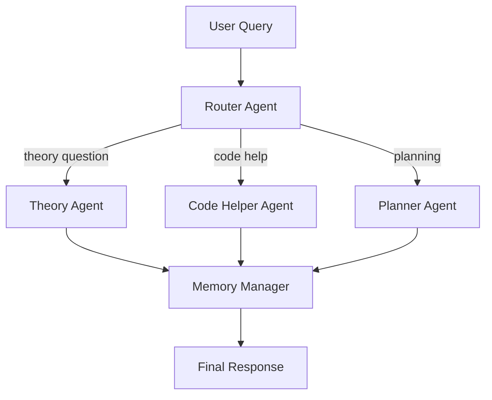

# Архитектура мультиагентного помощника по учёбе

## Обзор системы

Система помогает студентам с задачами по программированию, теории и планированию учёбы.

## Агенты

### 1. Router Agent (Маршрутизатор)
**Ответственность:** Анализ запроса пользователя и выбор подходящих агентов.

**Логика:**
- Классифицирует запрос по типу: theory / coding / planning / architecture
- Решает, какие агенты задействовать
- Передаёт управление выбранным агентам

### 2. Theory Agent (Теория)
**Ответственность:** Объяснение концепций, алгоритмов, паттернов.

**Возможности:**
- Объясняет теоретические понятия
- Использует memory для учёта ранее изученных тем
- Инструмент: `search_notes` - поиск в базе знаний

### 3. Code Helper Agent (Помощник по коду)
**Ответственность:** Помощь с реализацией, отладкой, review кода.

**Возможности:**
- Генерирует код по описанию
- Объясняет готовый код
- Находит ошибки
- Инструмент: `execute_code` - запуск кода для проверки

### 4. Planner Agent (Планировщик)
**Ответственность:** Создание учебных планов, разбивка задач.

**Возможности:**
- Разбивает большие задачи на подзадачи
- Создаёт расписание изучения
- Инструмент: `save_plan` - сохранение плана в память

### 5. Memory Manager Agent (опционально)
**Ответственность:** Управление контекстом и историей.

**Возможности:**
- Сохраняет историю диалога
- Извлекает релевантную информацию из прошлых сессий
- Поддерживает профиль студента

## Паттерны МАС

### Router Pattern
Router Agent анализирует запрос → выбирает специализированного агента → передаёт управление.

### Handoff (Передача управления)
1. User → Router: запрос поступает в систему
2. Router → Specialized Agent: классификация и передача 
3. Specialized Agent → Memory Manager: обновление контекста 
4. Memory Manager → User: финальный ответ

### Tool Calling
Инструменты:

1. search_notes(query: str) - поиск в базе знаний
2. execute_code(code: str, language: str) - выполнение кода
3. save_plan(plan: dict) - сохранение плана
4. get_history(limit: int) - получение истории диалога

### Управление памятью
State Structure:

`{
    "user_query": str,
    "query_type": Literal["theory", "coding", "planning", "architecture"],
    "conversation_history": list[dict],  # последние N сообщений
    "student_profile": dict,  # изученные темы, прогресс
    "current_plan": Optional[dict],  # активный план обучения
    "relevant_notes": list[str],  # извлечённые заметки
    "final_response": str
}`

Хранение:

- In-memory: список conversation_history в state
- Persistent: JSON-файл student_profile.json для долгосрочной памяти